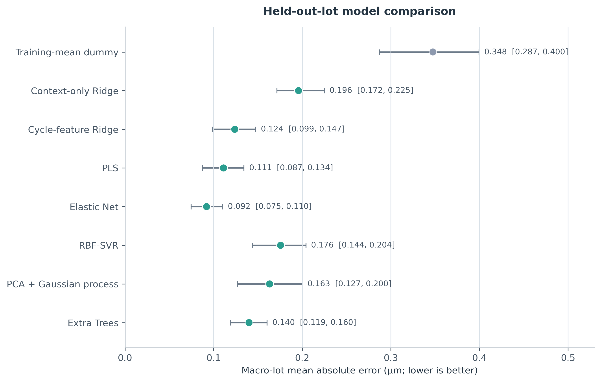
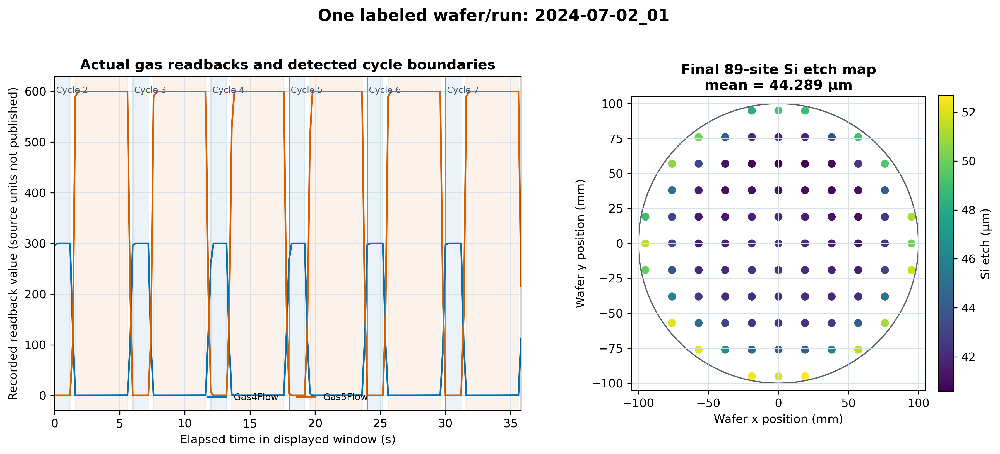

# BOSCH Etch Virtual Metrology

I built this project to test a practical question in semiconductor manufacturing: can the
process trace from a completed plasma-etch run predict the wafer result before laboratory
metrology is returned?

The analysis uses a public BOSCH plasma-etch dataset collected on real 200 mm silicon wafers.
For each wafer, I summarize the 100-cycle chamber trace into physically organized features and
predict the mean silicon etch depth measured at 89 sites after processing.

The best observed model, Elastic Net, reached a **macro-lot MAE of 0.0921 µm**, a pooled RMSE
of **0.1151 µm**, and an out-of-fold R² of **0.917**. The Cycle-feature Ridge baseline reached
0.1239 µm macro-lot MAE. All reported scores come from nested leave-one-lot-out evaluation;
they are not training scores.



## Prediction task

| Item | Definition |
| --- | --- |
| Sample | One wafer and its complete process run |
| Available labeled samples | 88 wafers from 10 lot/date groups |
| Raw process input | 31 common readback channels, about 3,200 timestamps per run at about 5 Hz |
| Process structure | 1 s nominal ignition followed by 100 alternating etch/passivation cycles |
| Model input | 81 features derived without using the target |
| Target | Arithmetic mean of 89 published final `si_etch` site values |
| Prediction time | After processing finishes and before physical metrology is available |
| Validation unit | A complete lot |

This is a post-run virtual metrology problem. The model observes what happened during the run;
it does not choose a recipe before the run. The process channels are monitored values and
readbacks, not a documented table of independently controllable recipe setpoints.

## What one sample contains

The source data are hierarchical:

```text
lot/date group
└── wafer and process run
    ├── 100 BOSCH cycles
    │   └── timestamps × process channels
    └── post-run metrology
        └── 89 fixed wafer coordinates
```

One supervised row represents one complete wafer run. Timestamps, cycles, and metrology sites
remain components of that sample; I do not turn them into independent labels. Wafers processed
in the same lot also share conditioning, date, tool, and chamber history, which is why complete
lots are held out during evaluation.

The example below is the chronologically first matched run, `2024-07-02_01`. The left panel
shows recorded Gas4/Gas5 readbacks and the cycle boundaries found by the feature code; the
right panel shows the final 89-site metrology map for the same wafer.



*This is one labeled wafer/run. The trace supplies model inputs; the scalar target is the
arithmetic mean of the 89 final site values.*

The published experiment planned 100 wafers. Four damaged wafers have no usable process run,
leaving 96 telemetry records. Of those, 88 have a matched complete 89-site metrology map and
form the modeling cohort.

The detailed file schemas, channel list, join key, measurement lineage, and feature formulas
are documented in [data/DATA_STRUCTURE.md](data/DATA_STRUCTURE.md).

## Feature engineering

Each process trace is a variable-length time series. I first retain its longest contiguous
timestamp block, then detect the 100 repeating cycles from the anonymous phase-switching flow
signals. The main cycle statistics use cycles 2–99 so that startup and shutdown behavior does
not dominate the run summary.

The final feature vector has four blocks:

| Feature block | Count | Construction |
| --- | ---: | --- |
| Cycle response | 56 | 14 gas, pressure, helium, platen-RF, and source-RF channels × four summaries |
| Timing | 10 | Phase duration, cycle period, timing variability, active span, and startup behavior |
| Slow state | 10 | Median level and early-to-late drift for five thermal or slow-flow channels |
| Context | 5 | Conditioning count, conditioning surface, and wafer order within the lot |
| **Total** | **81** | One fixed-length vector per wafer run |

For every cycle-response channel, the four summaries are:

- the median signal level across stable cycles;
- the median long-phase minus short-phase contrast;
- the median absolute deviation of that phase contrast; and
- the mean level of the last ten stable cycles minus the first ten.

The public files call the phase-switching channels `Gas4Flow` and `Gas5Flow` but do not map
those numbers to SF₆ or C₄F₈. I therefore use them as short- and long-phase proxies rather than
assigning undocumented gas identities.

Feature extraction is implemented in
[`src/bosch_vm/features.py`](src/bosch_vm/features.py). The complete experiment configuration
is stored in [`experiments/mean_si_etch/config.yaml`](experiments/mean_si_etch/config.yaml).

## Evaluation design

Random wafer splitting would make this dataset look easier than the intended deployment case.
I instead evaluate transfer to a new lot:

1. The outer loop holds out every wafer from one lot.
2. The remaining nine lots form the training set.
3. An inner leave-one-training-lot-out loop selects hyperparameters.
4. Imputation, variance filtering, scaling, PCA, and model fitting occur inside the relevant
   training folds.
5. Each of the 88 wafers receives one outer out-of-fold prediction.

The primary score is macro-lot MAE: I calculate MAE separately for each held-out lot and then
average the ten lot errors. This gives a four-wafer lot the same weight as a ten-wafer lot.
Pooled RMSE and overall out-of-fold R² are useful secondary summaries, but they can hide a weak
transfer result on an individual lot.

Metric intervals use a 10,000-repetition bootstrap that resamples lots rather than individual
wafers. The full evaluation design is recorded in
[`experiments/mean_si_etch/EXPERIMENT_PLAN.md`](experiments/mean_si_etch/EXPERIMENT_PLAN.md).

## Model comparison

I chose Ridge as the primary structured baseline and compared it with a training-mean model,
a context-only ablation, PLS, Elastic Net, RBF-SVR, PCA with Gaussian-process regression, and
Extra Trees. The same outer folds are used for every model.

| Model | Macro-lot MAE (µm) | Pooled RMSE (µm) | Outer-OOF R² |
| --- | ---: | ---: | ---: |
| Elastic Net | **0.0921** | **0.1151** | **0.917** |
| PLS | 0.1112 | 0.1415 | 0.875 |
| Cycle-feature Ridge | 0.1239 | 0.1556 | 0.848 |
| Extra Trees | 0.1400 | 0.1640 | 0.832 |
| PCA + Gaussian process | 0.1633 | 0.2101 | 0.724 |
| RBF-SVR | 0.1756 | 0.2209 | 0.694 |
| Context-only Ridge | 0.1958 | 0.2447 | 0.625 |
| Training-mean baseline | 0.3475 | 0.4044 | -0.024 |

Elastic Net produced the lowest error on this comparison and outperformed Cycle-feature Ridge
on 9 of 10 held-out lots. Because all model families were compared on the same ten outer
folds, I treat that ranking as a result to confirm on new lots rather than a final estimate of
which family will always perform best.

The full result tables and diagnostics are in the
[`technical report`](reports/wafer_mean_si_etch_lolo_v1.md) and
[`experiment log`](experiments/mean_si_etch/EXPERIMENT_LOG.md).

## What I learned

**Telemetry contributes beyond lot context.** Context-only Ridge was worse than Cycle-feature
Ridge on all ten held-out lots. Its macro-lot MAE was higher by 0.0719 µm.

**The RF/power block carried the strongest stable model signal.** Removing that block raised
macro-lot MAE by 0.0519 µm and hurt 9 of 10 lots. This is evidence that the fitted model relies
on those measurements; it is not evidence that changing an RF setting would cause the same
change in etch depth.

**The structured linear models were strongest among the tested configurations.** Elastic Net,
PLS, and Ridge ranked first through third. The tested RBF-SVR and PCA with Gaussian-process
regression configurations did not improve on them at this sample size.

**Preprocessing is part of the model.** Replacing `StandardScaler` with `RobustScaler` lowered
the Ridge macro-lot MAE by 0.0188 µm in the sensitivity analysis. That choice should be tested
inside the next model-family comparison rather than adopted from this single result alone.

## Limitations

- Generalization is assessed on 88 labeled wafers from only 10 lot/date groups on one tool.
  Wafers within a lot share chamber history, and conditioning factors are partially confounded
  with lot and date.
- This benchmark performs end-of-run virtual metrology: it uses the completed process trace to
  predict mean silicon etch depth. It does not support pre-run recipe selection, early-run
  intervention, or reconstruction of the 89-site wafer map.
- The silicon-etch target is derived from step-height and post-oxide measurements rather than
  measured directly. Approximately 2% of the post-oxide site values were spatially completed
  after fit failures, adding uncertainty to the target.
- Model coefficients and permutation importance describe predictive associations. They should
  not be interpreted as causal effects of changing recipe settings or chamber conditions.
- The tested Gaussian-process intervals were not calibrated: nominal 95% intervals achieved
  84.1% empirical coverage. They are therefore not suitable for automated metrology-skipping
  decisions.

With 88 labeled wafers, I did not train an LSTM or Transformer on the raw traces. The thousands
of timestamps within a run do not create thousands of independent wafer labels. The cycle
summaries retain phase response, variability, and within-run drift with a model size that the
lot-held-out evaluation can support.

## Reproduce the analysis

Python 3.11 or newer is required.

```bash
python3.11 -m venv .venv
source .venv/bin/activate
python -m pip install --upgrade pip
python -m pip install -e ".[dev]"
```

Download the compact source files from Zenodo and verify their published checksums:

```bash
python scripts/download_zenodo.py
```

Prepare the wafer table, run the nested comparison and sensitivity analysis, and regenerate
the figures and report:

```bash
bosch-vm prepare --config experiments/mean_si_etch/config.yaml --force
bosch-vm run --config experiments/mean_si_etch/config.yaml --n-jobs -1 --force
bosch-vm sensitivity --config experiments/mean_si_etch/config.yaml --n-jobs -1 --force
python scripts/generate_analysis_artifacts.py
```

Run the checks:

```bash
pytest
ruff check src tests scripts
```

Raw source files are never modified. Generated feature tables, detailed fold artifacts, and
serialized models stay outside Git and can be rebuilt from the configuration.

## Repository layout

| Path | Contents |
| --- | --- |
| [`src/bosch_vm/`](src/bosch_vm/) | Data loading, feature extraction, evaluation, modeling, sensitivity, and reporting code |
| [`experiments/`](experiments/) | Experiment configuration, design, and run notes |
| [`tests/`](tests/) | Schema, split, leakage, metric, CLI, and reporting tests |
| [`data/`](data/) | Source provenance and the data dictionary |
| [`results/`](results/) | Out-of-fold summaries, lot metrics, uncertainty checks, and split manifests |
| [`figures/`](figures/) | Figures regenerated from the result tables |
| [`reports/`](reports/) | Technical results |
| [`references/`](references/) | Dataset, virtual-metrology, validation, and interpretation sources |

## Next work

1. Compare Elastic Net and RobustScaler-Ridge with model-family selection inside the nested
   design, then evaluate the chosen procedure on new lots.
2. Model the full 89-site wafer map with a spatial basis fitted separately in each outer
   training fold.
3. Calibrate prediction intervals by lot and add a reliability gate for out-of-distribution
   wafers.
4. Compare process-only and process-plus-OES models on the same matched wafer cohort.

## Data and license

The source dataset is Sayyed et al., *A Multi-Model Dataset for BOSCH Plasma-Etching: Optical
Emission Spectra, Process Parameters, and Wafer Measurements for Data-Driven Plasma Modeling*,
Zenodo record 17122442 (2025),
[https://doi.org/10.5281/zenodo.17122442](https://doi.org/10.5281/zenodo.17122442).

The dataset is licensed under CC BY 4.0. File-level provenance, access date, checksums, and
exclusions are recorded in [`data/PROVENANCE.md`](data/PROVENANCE.md). Raw data are downloaded
directly from Zenodo and are not redistributed in this repository.

Project code is available under the [MIT License](LICENSE). See [NOTICE.md](NOTICE.md) for data
attribution and [CITATION.cff](CITATION.cff) for software citation metadata.
