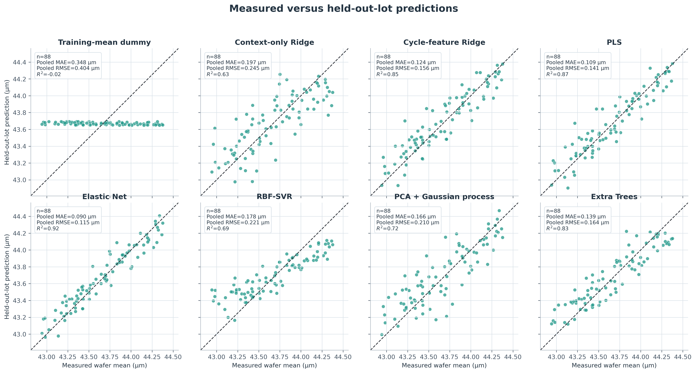
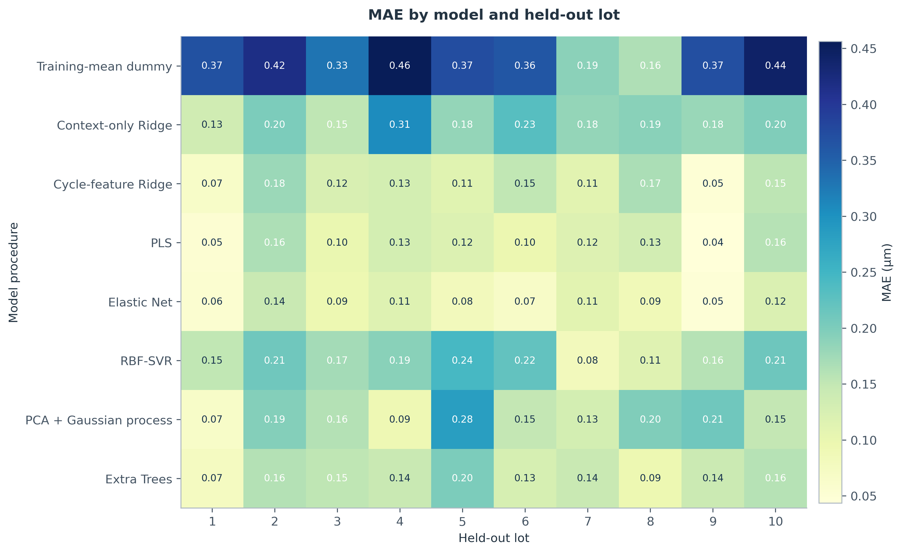
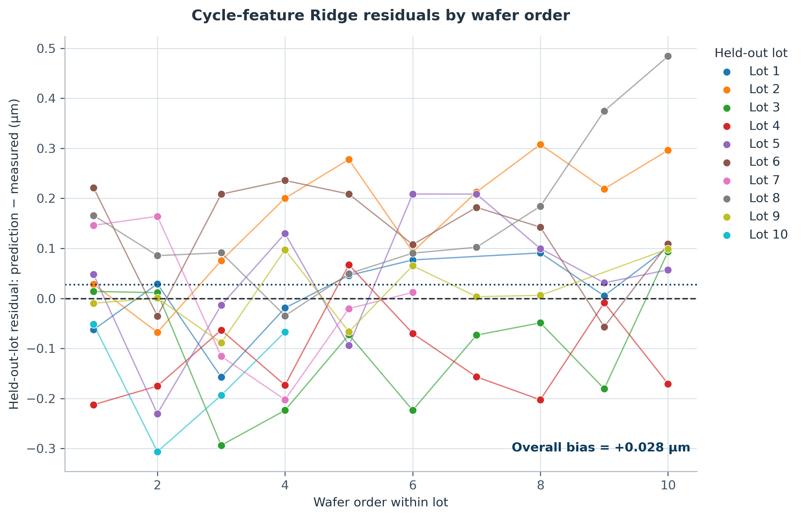
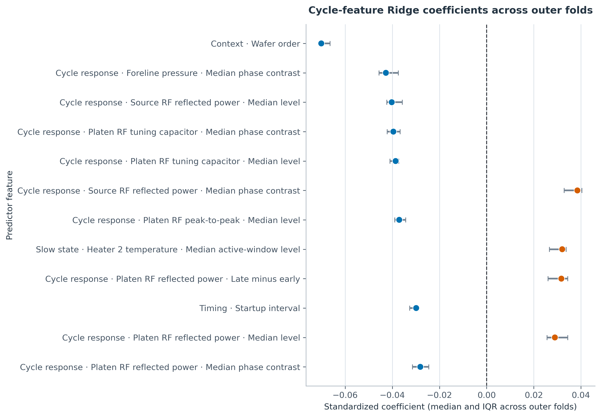
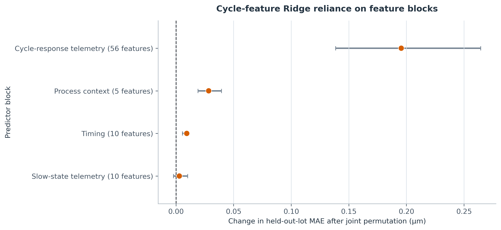
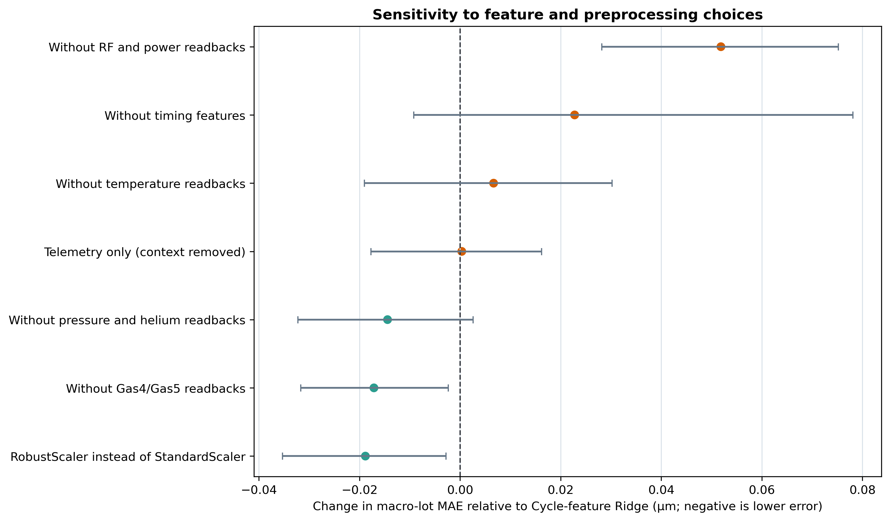
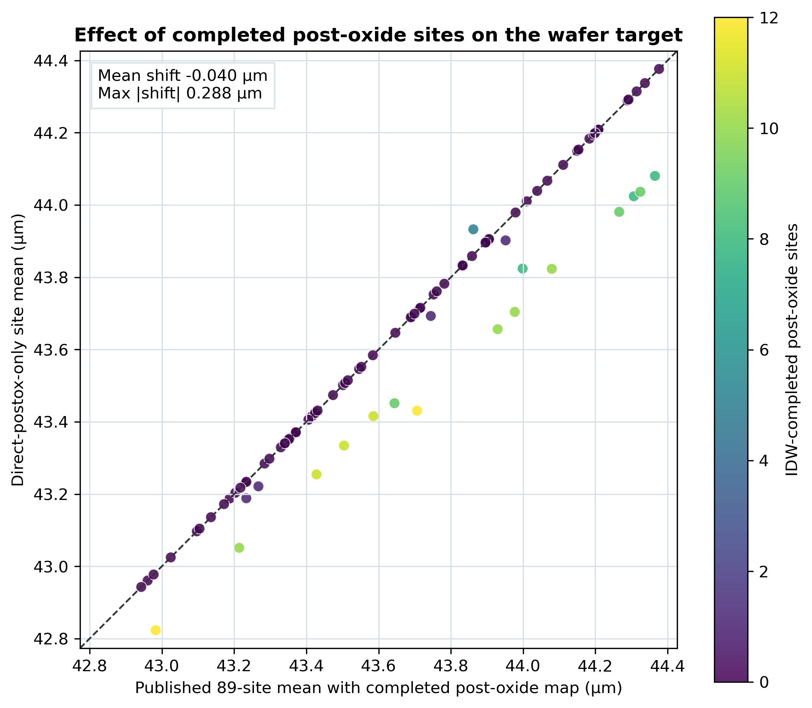
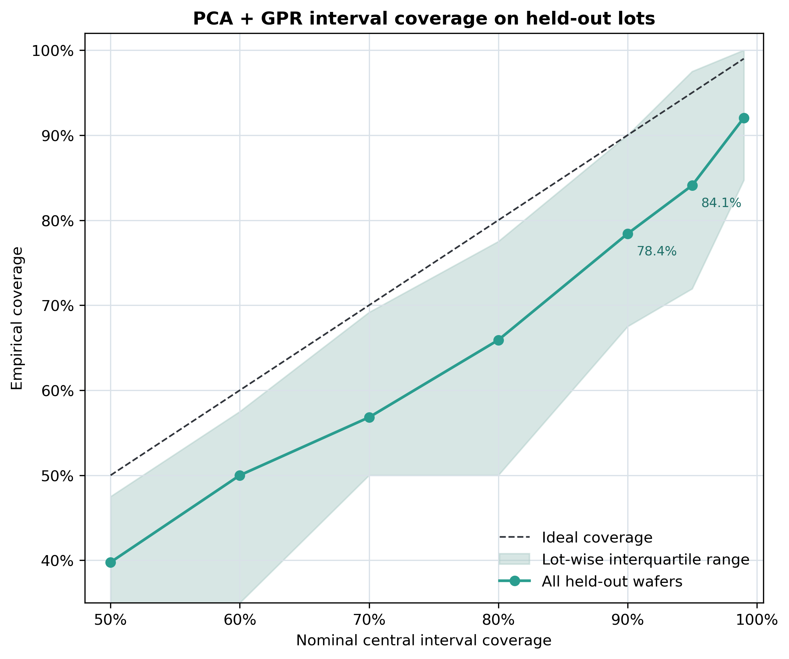

# Wafer-Mean Silicon Etch Virtual Metrology

## Results

This analysis predicts final wafer-mean silicon etch from the process trace of one completed
BOSCH run. The dataset provides 88 labeled wafers from 10 lots. One wafer/run is one sample;
timestamps, cycles, and metrology sites are kept inside that sample.

Cycle-feature Ridge reached a macro-lot MAE of **0.124 µm**
(95% lot-cluster interval 0.099–0.147), pooled RMSE
**0.156 µm**, and held-out R² **0.848**. Elastic Net had the
lowest MAE in this comparison at **0.092 µm**. Its lot-level MAE was
0.032 µm lower than Ridge on average and lower
on 9 of 10 lots. The ranking still needs
confirmation on new lots because all model families were compared on the same held-out data.

## Data and prediction task

- **Input:** 31 common process readbacks, about 3,200 timestamps at 5 Hz, summarized across
  100 process cycles into 81 features.
- **Target:** the arithmetic mean of the 89 published final `si_etch` site values.
- **Cohort:** 96 process runs; 88 have a matched complete 89-site map across 10 lots.
- **Prediction time:** after the run ends and before physical metrology is returned.

The figure below uses the chronologically first matched run, `2024-07-02_01`. The left
panel shows recorded gas readbacks and cycle boundaries found without using the target. The
right panel shows the final 89-site metrology map for the same wafer.

See the [data dictionary](../data/DATA_STRUCTURE.md) for field definitions and the target
calculation.

## Validation

Each outer fold holds out one complete lot and trains on the other nine. Imputation,
variance filtering, scaling, PCA, and hyperparameter search are fitted only on training
lots. Each wafer receives one prediction from a model that did not see its lot. No wafer's
89 sites cross fold boundaries.

Macro-lot MAE is the main metric: MAE is calculated separately for each lot and the ten lot
values are averaged. This prevents larger lots from dominating the score. The confidence
intervals resample lots rather than individual wafers.

## Model comparison

| Rank | Model | Macro-lot MAE [µm] (95% CI) | Pooled RMSE [µm] | OOF R² | SSE skill vs dummy |
| --- | --- | --- | --- | --- | --- |
| 1 | Elastic Net | 0.092 (0.075–0.110) | 0.115 | 0.917 | 0.919 |
| 2 | PLS | 0.111 (0.087–0.134) | 0.141 | 0.875 | 0.878 |
| 3 | Cycle-feature Ridge | 0.124 (0.099–0.147) | 0.156 | 0.848 | 0.852 |
| 4 | Extra Trees | 0.140 (0.119–0.160) | 0.164 | 0.832 | 0.836 |
| 5 | PCA + Gaussian process | 0.163 (0.127–0.200) | 0.210 | 0.724 | 0.730 |
| 6 | RBF-SVR | 0.176 (0.144–0.204) | 0.221 | 0.694 | 0.702 |
| 7 | Context-only Ridge | 0.196 (0.172–0.225) | 0.245 | 0.625 | 0.634 |
| 8 | Training-mean dummy | 0.348 (0.287–0.400) | 0.404 | -0.024 | 0.000 |

Context-only Ridge was worse than Cycle-feature Ridge by
+0.072 µm (95% paired lot-cluster interval
+0.046 to +0.102) and was worse on
all 10 lots. The completed process trace therefore adds useful predictive information beyond
conditioning and wafer order in this dataset. RBF-SVR and PCA+GPR did not improve on the
regularized linear models.

*Points are means of ten held-out-lot MAEs; bars are 95% lot-cluster bootstrap intervals.*

*Each point is one wafer predicted while its lot was held out. Metric boxes report pooled
wafer errors, while the comparison table uses macro-lot MAE.*

## Lot-to-lot behavior

| Lot | n | MAE [µm] | RMSE [µm] | Bias [µm] | Within-lot R² |
| --- | --- | --- | --- | --- | --- |
| 1 | 9 | 0.065 | 0.079 | +0.012 | 0.961 |
| 2 | 10 | 0.178 | 0.203 | +0.164 | 0.771 |
| 3 | 10 | 0.123 | 0.155 | -0.100 | 0.830 |
| 4 | 10 | 0.130 | 0.146 | -0.117 | 0.916 |
| 5 | 10 | 0.112 | 0.135 | +0.045 | 0.863 |
| 6 | 10 | 0.151 | 0.165 | +0.132 | 0.825 |
| 7 | 6 | 0.110 | 0.131 | -0.003 | 0.675 |
| 8 | 10 | 0.166 | 0.218 | +0.159 | -0.201 |
| 9 | 9 | 0.049 | 0.063 | +0.012 | 0.974 |
| 10 | 4 | 0.155 | 0.186 | -0.155 | -0.122 |

The largest Ridge lot MAE was 0.178 µm on lot 2. Within-lot R²
was negative on lots 8 and 10; those lots have narrow target ranges, and lot 10 has only four
labeled wafers. Per-lot absolute error is more stable than per-lot R² here.

*Connected points show order within one lot; they are not a continuous timeline across lots.*

## Tuning results

| Model | Parameter | All-data refit value | LOGO selection MAE [µm] |
| --- | --- | --- | --- |
| Training-mean dummy | (no tuned parameter) | training mean | 0.348 |
| Context-only Ridge | model__alpha | 1.0 | 0.193 |
| Cycle-feature Ridge | model__alpha | 10.0 | 0.117 |
| PLS | model__n_components | 5 | 0.110 |
| Elastic Net | model__alpha | 0.01 | 0.091 |
| Elastic Net | model__l1_ratio | 0.9 | 0.091 |
| RBF-SVR | model__C | 1.0 | 0.176 |
| RBF-SVR | model__epsilon | 0.05 | 0.176 |
| RBF-SVR | model__gamma | scale | 0.176 |
| PCA + Gaussian Process | pca__n_components | 3 | 0.149 |
| Extra Trees | model__max_depth | 4 | 0.140 |
| Extra Trees | model__max_features | 1.0 | 0.140 |
| Extra Trees | model__min_samples_leaf | 3 | 0.140 |

Ridge selected `alpha=10` in eight of ten outer folds. Elastic Net selected `alpha=0.01`
and `l1_ratio=0.9` in seven of ten folds. The all-data refits are saved for reuse but do not
contribute to any held-out result.

## Model interpretation

The largest Ridge coefficients included wafer order, foreline-pressure phase contrast,
source-RF reflected-power summaries, platen-RF tuning signals, heater state, and startup
timing. Each coefficient is the change in predicted micrometres associated with a
one-standard-deviation feature change after accounting for the other inputs. Correlated
readbacks can redistribute coefficient weight, so these are predictive associations rather
than effects of changing a recipe setting.

| Feature | Median coefficient | Q25 | Q75 |
| --- | --- | --- | --- |
| Context · Wafer order | -0.0701 | -0.0710 | -0.0664 |
| Cycle response · Foreline pressure · Median phase contrast | -0.0427 | -0.0456 | -0.0374 |
| Cycle response · Source RF reflected power · Median level | -0.0402 | -0.0424 | -0.0358 |
| Cycle response · Platen RF tuning capacitor · Median phase contrast | -0.0396 | -0.0422 | -0.0367 |
| Cycle response · Platen RF tuning capacitor · Median level | -0.0386 | -0.0410 | -0.0373 |
| Cycle response · Source RF reflected power · Median phase contrast | +0.0385 | +0.0329 | +0.0405 |
| Cycle response · Platen RF peak-to-peak · Median level | -0.0371 | -0.0389 | -0.0344 |
| Slow state · Heater 2 temperature · Median active-window level | +0.0321 | +0.0267 | +0.0338 |
| Cycle response · Platen RF reflected power · Late minus early | +0.0317 | +0.0260 | +0.0344 |
| Timing · Startup interval | -0.0299 | -0.0326 | -0.0290 |
| Cycle response · Platen RF reflected power · Median level | +0.0290 | +0.0256 | +0.0344 |
| Cycle response · Platen RF reflected power · Median phase contrast | -0.0281 | -0.0315 | -0.0245 |

The cycle-response block produced the largest error increase when jointly permuted. It also
contains 56 correlated features, so its value is not directly comparable to a five-feature
context block and does not identify a causal control knob.

| Feature block | Median held-out ΔMAE [µm] | Q25 | Q75 |
| --- | --- | --- | --- |
| Cycle-response telemetry (56 features) | +0.196 | +0.139 | +0.264 |
| Process context (5 features) | +0.028 | +0.019 | +0.040 |
| Timing (10 features) | +0.009 | +0.006 | +0.011 |
| Slow-state telemetry (10 features) | +0.003 | -0.002 | +0.010 |

*Outer-fold fits share most of their training lots; sign consistency is descriptive, not ten
independent replications.*

## Sensitivity checks

| Change | Features | Macro-lot MAE [µm] | Δ vs Ridge [95% interval] | Lots with lower error |
| --- | --- | --- | --- | --- |
| Telemetry only (context removed) | 76 | 0.124 | +0.000 [-0.018, +0.016] | 3 |
| Without Gas4/Gas5 readbacks | 64 | 0.107 | -0.017 [-0.032, -0.002] | 8 |
| Without pressure and helium readbacks | 69 | 0.109 | -0.014 [-0.032, +0.003] | 6 |
| Without RF and power readbacks | 44 | 0.176 | +0.052 [+0.028, +0.075] | 1 |
| Without temperature readbacks | 75 | 0.131 | +0.007 [-0.019, +0.030] | 3 |
| Without timing features | 71 | 0.147 | +0.023 [-0.009, +0.078] | 7 |
| RobustScaler instead of StandardScaler | 81 | 0.105 | -0.019 [-0.035, -0.003] | 8 |
| Direct post-oxide sites only | 81 | 0.117 | different target | 0 |

- Removing RF and power readbacks increased macro-lot MAE by
  +0.052 µm (95% interval
  +0.028 to +0.075).
- RobustScaler reduced MAE by 0.019 µm in this
  comparison and should be evaluated again on new lots.
- Removing Gas4/Gas5 readbacks reduced MAE by
  0.017 µm. This can reflect redundancy or
  unstable readbacks; it does not mean gas chemistry is unimportant.

*Intervals are paired lot-cluster bootstrap intervals. Negative values mean lower error than
the unchanged Ridge pipeline.*

## Metrology lineage

The published target contains 157 failed post-etch spectral fits completed by inverse-distance
weighting, mainly in lot 3 (86 sites) and lot 4
(62 sites). Recomputing the target from direct post-oxide fits
only gave macro-lot MAE 0.117 µm and held-out R²
0.846. The alternative target was lower by
0.040 µm on average and differed by as much as
0.288 µm for one wafer. This is a change in target
definition, not a model improvement.

*Color shows how many post-oxide sites on each wafer were completed by interpolation.*

## Uncertainty calibration

PCA+GPR's predicted standard deviation had Spearman correlation 0.057 with absolute
error. Nominal 90% and 95% Gaussian intervals covered 78.4% and 84.1%
of held-out wafers. Both intervals under-covered and should not be used as a metrology-skip
gate without group-aware calibration.

*The diagonal is the correct reference here: nominal interval coverage versus observed
coverage. The shaded band is the interquartile range across the ten held-out lots.*

## Sample size

There are 88 labeled wafer runs across 10 lots. The timestamps within each run share one
final wafer label. I used cycle summaries and regularized models to keep the number of
parameters small; sequence neural networks haven't been evaluated here.

## Next steps

Next I want to test a physics informed model that combines a simple etch model with a
neural network correction. I would compare it with Elastic Net on held out lots.

PLS/Ridge and batch-feature choices are consistent with Virtual Metrology literature,
including [Khan et al.](https://doi.org/10.1016/j.jprocont.2008.04.014) and
[Suthar et al.](https://doi.org/10.1016/j.compchemeng.2019.05.016).

## Reproduction

~~~bash
python scripts/download_zenodo.py
bosch-vm prepare --config experiments/mean_si_etch/config.yaml --force
bosch-vm run --config experiments/mean_si_etch/config.yaml --n-jobs -1 --force
bosch-vm sensitivity --config experiments/mean_si_etch/config.yaml --n-jobs -1 --force
python scripts/generate_analysis_artifacts.py
pytest
~~~

Full local runs save inner-search scores, held-out predictions, selected hyperparameters,
interpretation tables, and all-data refits under
`results/wafer_mean_si_etch_lolo_v1/models/<model>/`. Reported performance comes from
held-out predictions, not from the all-data refit.
